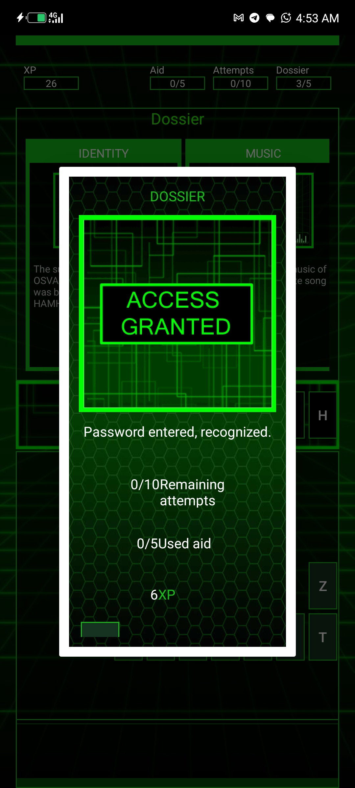
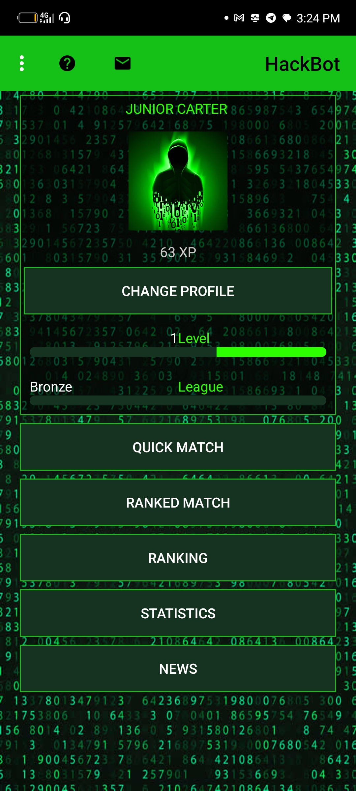

# ⚠️ LEGAL AND ETHICAL WARNING | ONYO LA KISHERIA

> [!CAUTION]
> **PLEASE READ CAREFULLY BEFORE PROCEEDING**
> 
> All information provided in this repository (e.g., IP Tracking, Network Auditing) is for **EDUCATIONAL PURPOSES ONLY**. 

### 🚫 RULES OF ENGAGEMENT:
* **Consent First**: Never use these tools on any network or device without explicit written permission.
* **Legal Compliance**: Unauthorized access to computer systems is a criminal offense under the Cybercrime Act.
* **Personal Responsibility**: The author (**Junior / The Architect**) is NOT responsible for any misuse or legal consequences resulting from the use of this code.

---

### 🇹🇿 TAFSIRI YA KISWAHILI (ONYO):
Mambo yote yaliyomo humu ni kwa ajili ya **ELIMU PEKEE**.
1. **Ruhusa**: Usijaribu mbinu hizi bila ruhusa ya mmiliki wa mtandao.
2. **Sheria**: Kuingilia faragha ya mtu ni kosa la kisheria.
3. **Wajibu**: Kila mmoja anawajibika kwa matendo yake mbele ya sheria.

**"Security is a mindset, not just a tool."**

 # 📝 LogicMaster-Archive
> **"Turning Logic into Solutions | Decoding the Binary World"**

## 🚀 Kuhusu Mimi (The Architect)
Mimi ni **Junior Software 76**, mtaalamu wa uchambuzi wa mantiki (Logic Analysis) na mifumo ya data. Mradi huu ni hifadhi maalum ya utafiti wangu katika:
* **Binary & Hex Analysis** 🔢
* **Cybersecurity Logic** 🛡️
* **IP & Network Data Mapping** 🌐

## 🛠️ Ujuzi Wangu (Technical Stack)
Hapa kuna vitu ninavyotumia zaidi kwenye uchambuzi wangu:
*  **Mantiki ya Mifumo**
*  **Ulinzi wa Data**
*  **Urambazaji wa Data**

## 📂 Nini Kilichomo?
| Sehemu | Maelezo |
| :--- | :--- |
| `Binary-Files` | Uchambuzi wa kodi za mashine (010101). |
| `Network-Logic` | Ramani za IP na muunganisho wa mifumo. |
| `Drafts` | Mawazo na miradi mipya inayokuja. |

## 🤝 Tuwasiliane (Connect with Me)
Kama una biashara, mradi, au unataka kubadilishana mawazo ya kitalaamu:

* **Telegram:** [Junior_costomer_010101](https://t.me/Junior_costomer_010101)
* **WhatsApp:** [Business Chat](https://wa.me/255689605717)
* **Facebook:** [OnlineJob](https://facebook.com/OnlineJob)

---
*© 2026 Junior76Carter | Built with Logic.*
---
---
### 📸 Visual Evidence (Game Logic Decryption)
*Below are the screenshots proving the successful logic analysis and decryption of the game's security layer:*

> **Note:** These results were achieved using binary pattern recognition and logical mapping.
